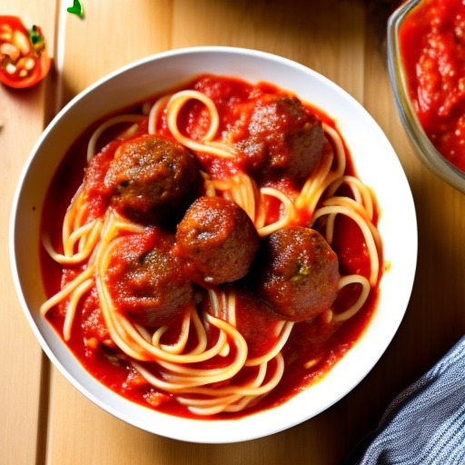
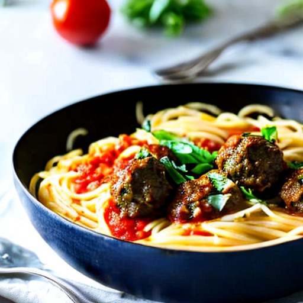
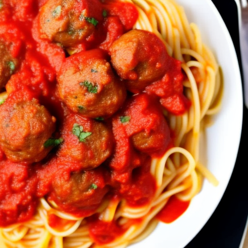
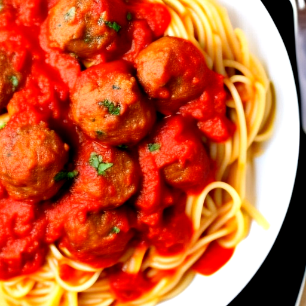
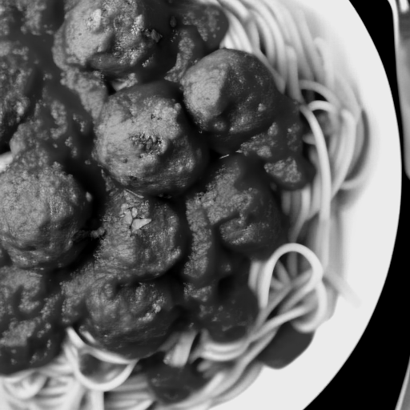
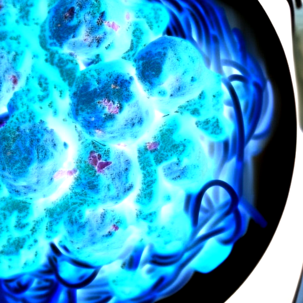
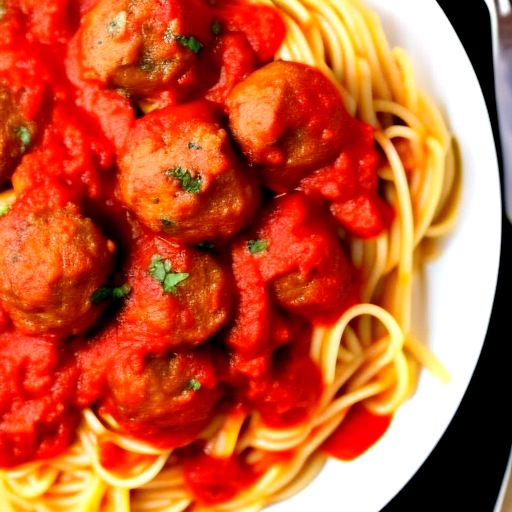

# Picture creator

Creates a picture using stable diffusion 1.5<br>
Everything is configurable within the main file and environment variables<br>
After running once you can run always offline, the first time is to download the model<br>
THe examples bellow were made with CPU i5-1035G1 & 6GB of RAM

## Examples made with this code:
<table style="margin:auto; margin:auto; text-align:center; align-items:center; justify-content:center;">
    <tr>
        <td></td>
        <td></td>
    </tr>
</table>

## Existing editing features:
<table style="border:1px solid white; margin:auto; margin:auto; text-align:center; align-items:center; justify-content:center;">
  <tr>
    <th>Normal</th>
    <th>Enhanced</th>
    <th>Grey scaled</th>
    <th>Negative</th>
    <th>Hide specific color</th>
  </tr>
  <tr>
    <td></td>
    <td></td>
    <td></td>
    <td></td>
    <td></td>
  </tr>
</table>

## What you need to install to run this:
```shell
pip install diffusers transformers accelerate pillow
```

## How to run:
```shell
python main.py
```

## Where all models installed:
```
~/.cache/huggingface/hub
```

## TODO:
<ol>
    <li>Add validation for prompt to initiate specific agents after creation of the image</li>
    <li>Add text generation model that will improve the given prompt and negative prompt</li>
    <li>Add upscale model to boost image visualization</li>
    <li>Decide if input will be reading from Kafka or GRPC and implement</li>
    <li>Tests</li>
    <li>Docker</li>
</ol>
